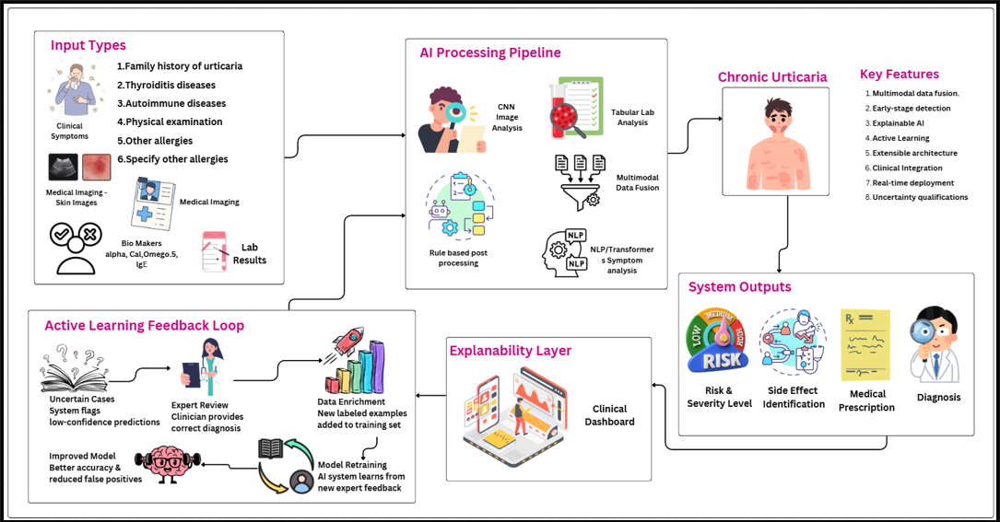

<div align="center">

# 🩺 AURA
# Interpretable Multimodal AI System for Chronic Urticaria Decision Support

[](https://www.python.org/)
[](https://reactjs.org/)
[](https://fastapi.tiangolo.com/)
[](https://pytorch.org/)
[](https://spring.io/projects/spring-boot)
[](#license)

### **A research-oriented, interpretable multimodal AI system** designed to support clinicians and medical students in **chronic urticaria risk assessment, severity evaluation, and treatment decision support**.

[Key Features](#key-features) • [High-Level Workflow](#high-level-workflow) • [Tech Stack](#tech-stack) • [Environment Setup](#environment-setup) • [Team](#team)

---

</div>

The system integrates **clinical images, structured laboratory data, and free-text clinical notes** using deep learning models, and provides **explainable outputs** with a **human-in-the-loop clinician feedback mechanism**.

## Key Features 

### ✅ 1. Risk & Severity Assessment
- Predicts **chronic urticaria risk and severity levels** using multimodal inputs
- Configurable severity classes (e.g., *Low / Moderate / High*)
- Supports **control assessment** and trend analysis when longitudinal data is available

### ✅ 2. Drug-Class & Treatment Guideline Recommendation
- **Guideline-Driven Drug & Step Prediction:** Recommends treatment class and escalation step aligned with international urticaria guidelines.
- **Clinical Safety Control:** Uses calibrated confidence, entropy, and rule-based checks to decide RECOMMEND / REVIEW / ABSTAIN.
- **Robust Multimodal Fusion Neural Network:** Dynamically gates image, lab, and clinical inputs to reduce noise and prevent unsafe dominance.

### ✅ 3. Explainability Dashboard
- **Visual explanations** for image-based predictions (Grad-CAM heatmaps)
- **Feature importance summaries** for laboratory and structured inputs
- Text-based reasoning such as:
  - *Why this recommendation was suggested*
  - *What factors most influenced the decision*

### ✅ 4. Clinician Feedback & Correction (Human-in-the-Loop)
Clinicians can:
- Accept or reject predictions
- Correct severity levels or recommended drug classes
- Add clinical notes and rationale

Collected feedback is used for:
- Model refinement and retraining
- Guideline alignment validation
- UI/interaction improvement analysis

---

## High-Level Workflow 



1. **Patient Data Entry**
   - Upload clinical images (optional)
   - Enter symptoms and clinical notes
   - Input laboratory values (IgE, CRP, VitD, FT4, etc.)

2. **Multimodal Inference**
   - Preprocessing → Encoding → Fusion → Drug, Medical Guideline, Medicines, Severity/Risk Prediction & Confidence Score

3. **Treatment Recommendation**
   - Severity output + guideline logic → treatment step & drug class

4. **Explainability Rendering**
   - Image heatmaps, feature importance, decision rationale

5. **Clinician Feedback Loop**
   - Accept / correct predictions → feedback stored for improvement

---

## Tech Stack 

### Frontend
- **React.js**
- **Flowbite + TailwindCSS** (dark-mode UI)
- **Recharts** (risk trends, severity visualization)
- **Redux**

### Backend API
- **Python FastAPI** (REST APIs)
- **Uvicorn** (ASGI server)
- **Pydantic** (request/response validation)
- **Spring Boot**
- Optional **JWT-based authentication** for role control

---

## AI / Deep Learning Architecture

AURA uses a **three-branch multimodal deep learning architecture** followed by a fusion network.

### 1️⃣ Image Analysis Branch
- **EfficientNetB3**
- Purpose: Feature extraction from skin images (wheals, erythema, rashes)
- Framework: **TensorFlow / Keras**
- Preprocessing: OpenCV, Pillow, NumPy

### 2️⃣ Clinical Notes (Text) Branch
- **ClinicalBERT**
- Purpose: Representation learning from free-text clinical notes
- Framework: **HuggingFace Transformers**
- Tokenization: BERT WordPiece tokenizer

### 3️⃣ Laboratory / Structured Data Branch
- **MLP (Multi-Layer Perceptron)**
- Purpose: Modeling numerical and categorical lab features
- Framework: **TensorFlow / Keras**
- Processing: Pandas, scikit-learn (scaling, encoding)

### 🔗 Fusion & Prediction Head
- Multimodal fusion (concatenation / attention-based)
- Outputs:
  - Drug, Medical Guideline, Medicines Prediction
  - Risk / severity classification
  - Control assessment score
  - Optional confidence estimation

---

## Explainability & Interpretability

- **Grad-CAM** for EfficientNetB3 image explanations
- Feature attribution summaries for lab inputs
- Attention/importance cues from ClinicalBERT
- Transparent decision logic linked to guideline steps

---

## Deployment & Dev Tools
- **Docker** (containerization)
- **GitHub Actions** (CI/CD)
- **MLflow / Weights & Biases** (experiment tracking)

---

## Prerequisites

- **Node.js** ≥ 18
- **Python** ≥ 3.10
- **pip** or **conda**
- **Git**
- Optional: **CUDA-enabled GPU** for faster training/inference

---

## Environment Setup 

### 1️⃣ Clone the Repository
```bash
git clone <your-repo-url>
cd AURA
```

2️⃣ Frontend Setup (React)
```bash
cd frontend
npm install
```

Create .env file:
```bash
VITE_API_BASE_URL=http://localhost:8000
```

Run frontend:
```bash
npm run dev
```

3️⃣ Backend Setup (FastAPI)
```bash
cd backend
python -m venv .venv
Windows: .venv\Scripts\activate
pip install -r requirements.txt
```

Run API server: 
```bash
uvicorn app:app --reload --port 8000
```

Access:
Frontend: http://localhost:5173
Backend API: http://localhost:8000

## Ethics, Privacy & Security

- Patient data must be fully anonymized
- No personally identifiable information stored
- Feedback and edits are audit-logged
- System is designed to support, not replace, clinical judgment

## License
Specify license (Academic / MIT / Institutional).

## Team

- Gamage S S J (Lead) `https://github.com/samidisjg`
- Nimes R H R `https://github.com/ramindu-Nimex`
- Damnidu T W T `https://github.com/Thewa-AlienHub`
- P Pradicksha `https://github.com/Pradi-Hub`

## Copyright
© 2026 AURA. All rights reserved.
